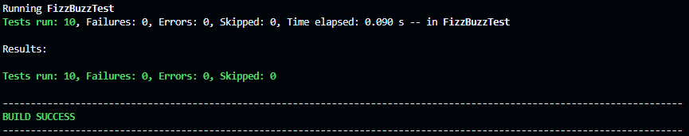

# ARCN_LabTDD - Laboratorio de Test-Driven Development

## 📋 Descripción

Este es un laboratorio educativo que implementa el clásico problema **FizzBuzz** utilizando la metodología **Test-Driven Development (TDD)** en Java. El proyecto demuestra cómo escribir pruebas primero y luego implementar la lógica del negocio para satisfacer esas pruebas.

## 🎯 Objetivo

El propósito de este repositorio es proporcionar un ejemplo práctico de:
- **Test-Driven Development (TDD)**: Escribir pruebas antes de implementar la funcionalidad
- **Pruebas Unitarias**: Crear pruebas exhaustivas con JUnit 5
- **Patrón AAA**: Implementar pruebas con Arrange-Act-Assert
- **Código Limpio**: Refactorización y mantenibilidad
- **Convenciones de Java**: Nombres, documentación y estructuración del código

## 🎮 El Problema FizzBuzz

El problema FizzBuzz es un ejercicio clásico de programación donde se debe:

1. **Retornar el número como String** si no cumple ninguna condición
2. **Retornar "Fizz"** si el número es múltiplo de 3
3. **Retornar "Buzz"** si el número es múltiplo de 5
4. **Retornar "FizzBuzz"** si el número es múltiplo de ambos (3 y 5)

### Ejemplo

```java
FizzBuzz.fizzBuzz(1)   // "1"
FizzBuzz.fizzBuzz(3)   // "Fizz"
FizzBuzz.fizzBuzz(5)   // "Buzz"
FizzBuzz.fizzBuzz(15)  // "FizzBuzz"
FizzBuzz.fizzBuzz(7)   // "7"
```

## 💻 Implementación

La clase [FizzBuzz.java](src/main/java/FizzBuzz.java) implementa la solución con:

- **Constantes de Divisores**: `DIVISOR_FIZZ = 3` y `DIVISOR_BUZZ = 5`
- **Constantes de Respuesta**: `FIZZ`, `BUZZ` y `FIZZBUZZ`
- **Método público**: `fizzBuzz(int numero)` que retorna el resultado
- **Métodos privados**: Funciones auxiliares para verificar divisibilidad:
  - `esMultiploDe3(int numero)`
  - `esMultiploDe5(int numero)`
  - `esMultiploDe3Y5(int numero)`
  - `esMultiploDe(int numero, int divisor)` - Método reutilizable base

Esta estructura separa responsabilidades, elimina duplicación y hace el código más legible y mantenible.

```java
public static String fizzBuzz(int numero) {
    if (esMultiploDe3Y5(numero)) {
        return FIZZBUZZ;
    }
    if (esMultiploDe3(numero)) {
        return FIZZ;
    }
    if (esMultiploDe5(numero)) {
        return BUZZ;
    }
    return String.valueOf(numero);
}
```

## ✅ Suite de Pruebas

El archivo [FizzBuzzTest.java](src/test/java/FizzBuzzTest.java) contiene **10 casos de prueba** que cubren completamente el comportamiento esperado:

### Casos de Prueba Básicos
- ✓ Retorna número como String (no múltiplo)
- ✓ Retorna "Fizz" para múltiplos de 3
- ✓ Retorna "Buzz" para múltiplos de 5
- ✓ Retorna "FizzBuzz" para múltiplos de 3 y 5

### Casos de Prueba Adicionales
- ✓ "Fizz" para múltiplos de 3 no obvios (ej: 9)
- ✓ "Buzz" para múltiplos de 5 no obvios (ej: 25)
- ✓ "FizzBuzz" para múltiplos de 3 y 5 no obvios (ej: 30)
- ✓ Números que no son múltiplos
- ✓ "FizzBuzz" para número 45
- ✓ Número 1 como String

Cada prueba sigue el **patrón AAA**:

```java
@Test
void testRetornaFizzParaMultiploDe3() {
    // Arrange (Preparar)
    int numero = 3;

    // Act (Actuar)
    String resultado = FizzBuzz.fizzBuzz(numero);

    // Assert (Verificar)
    assertEquals("Fizz", resultado);
}
```

## 🔄 Cambios Recientes - Refactorización

Se realizó una refactorización completa del código para mejorar su claridad, mantenibilidad y adherencia a las mejores prácticas de Java.

### 1️⃣ Documentación JavaDoc Completa

Se agregaron comentarios JavaDoc detallados a todos los métodos públicos y privados:

```java
/**
 * Clase que implementa el problema clásico FizzBuzz.
 * 
 * Retorna:
 * - "FizzBuzz" si el número es múltiplo de 3 y 5
 * - "Fizz" si el número es múltiplo de 3
 * - "Buzz" si el número es múltiplo de 5
 * - El número como String en cualquier otro caso
 */
public class FizzBuzz { ... }
```

Consulta la [clase completa](src/main/java/FizzBuzz.java) para ver toda la documentación.

### 2️⃣ Nomenclatura Mejorada (CamelCase Estricto)

**Cambio principal**: `fizzbuzz()` → `fizzBuzz()`

- ✏️ Sigue la convención camelCase estándar de Java
- ✏️ Mayor claridad y consistencia con estándares industria
- 🟢 Nuevo método (con camelCase correcto): [línea 27](src/main/java/FizzBuzz.java#L27)

Antes:
```java
public static String fizzbuzz(int numero) { ... }
```

Después:
```java
/**
 * Procesa un número según las reglas de FizzBuzz.
 *
 * @param numero el número a procesar
 * @return la cadena resultante según las reglas de FizzBuzz
 */
public static String fizzBuzz(int numero) { ... }
```

### 3️⃣ Constantes de Divisores Explícitas

Extracción de valores mágicos como constantes documentadas:

```java
// Constantes de divisores
private static final int DIVISOR_FIZZ = 3;
private static final int DIVISOR_BUZZ = 5;

// Constantes de respuesta
private static final String FIZZ = "Fizz";
private static final String BUZZ = "Buzz";
private static final String FIZZBUZZ = "FizzBuzz";
```

✨ **Beneficios:**
- Facilita el mantenimiento si los divisores cambian en el futuro
- Mayor claridad sobre qué representan los números 3 y 5
- Reducción de valores mágicos en el código

### 4️⃣ Método Auxiliar Reutilizable - Eliminación de Duplicación

Se creó un método base genérico para verificar divisibilidad:

```java
/**
 * Verifica si un número es múltiplo de un divisor dado.
 *
 * @param numero el número a verificar
 * @param divisor el divisor a usar
 * @return true si numero es múltiplo de divisor, false en caso contrario
 */
private static boolean esMultiploDe(int numero, int divisor) {
    return numero % divisor == 0;
}
```

Los métodos específicos ahora lo utilizan:

```java
private static boolean esMultiploDe3(int numero) {
    return esMultiploDe(numero, DIVISOR_FIZZ);
}

private static boolean esMultiploDe5(int numero) {
    return esMultiploDe(numero, DIVISOR_BUZZ);
}
```

✨ **Beneficios:**
- ✅ DRY (Don't Repeat Yourself): El cálculo `numero % divisor == 0` aparece una sola vez
- ✅ Mantenibilidad: Cambios en la lógica se hacen en un único lugar
- ✅ Claridad: Cada método tiene una responsabilidad única

### 5️⃣ Formato y Legibilidad Mejorada

Mayor claridad en la legibilidad del flujo de control:

Antes:
```java
public static String fizzbuzz(int numero) {
    if (esMultiploDe3Y5(numero)) return FIZZBUZZ;
    if (esMultiploDe3(numero))   return FIZZ;
    if (esMultiploDe5(numero))   return BUZZ;
    return String.valueOf(numero);
}
```

Después:
```java
public static String fizzBuzz(int numero) {
    if (esMultiploDe3Y5(numero)) {
        return FIZZBUZZ;
    }
    if (esMultiploDe3(numero)) {
        return FIZZ;
    }
    if (esMultiploDe5(numero)) {
        return BUZZ;
    }
    return String.valueOf(numero);
}
```

### ✅ Resultado de las Pruebas

Todas las 10 pruebas unitarias pasaron correctamente tras la refactorización:

```
Tests run: 10, Failures: 0, Errors: 0, Skipped: 0 ✅
BUILD SUCCESS
```

**Captura de pantalla de pruebas exitosas:**


*Espacio reservado para captura de pantalla de los resultados de `mvn test`*

### 📊 Comparativa - Antes vs Después

| Aspecto | Antes | Después |
|---------|-------|---------|
| **Documentación JavaDoc** | ❌ No | ✅ Sí, completa |
| **Nombre del Método** | `fizzbuzz()` | `fizzBuzz()` |
| **Constantes de Divisores** | ❌ Valores mágicos (3, 5) | ✅ `DIVISOR_FIZZ`, `DIVISOR_BUZZ` |
| **Duplicación de Código** | Sí (3 métodos con `numero % x == 0`) | ✅ Centralizado en `esMultiploDe()` |
| **Formato** | One-liners | ✅ Bloques claros |
| **Adherencia a Convenciones Java** | Parcial | ✅ Completa |

## 🚀 Como Ejecutar

### Compilar el Proyecto
```bash
mvn clean compile
```

### Ejecutar las Pruebas
```bash
mvn test
```

### Compilar y Ejecutar Tests
```bash
mvn clean test
```

### Ver Reportes de Tests
Después de ejecutar los tests, se generan reportes en:
- `target/surefire-reports/FizzBuzzTest.txt` (texto)
- `target/surefire-reports/TEST-FizzBuzzTest.xml` (XML)

### Resultado Esperado
```
[INFO] Running FizzBuzzTest
[INFO] Tests run: 10, Failures: 0, Errors: 0, Skipped: 0, Time elapsed: 0.104 s
[INFO] BUILD SUCCESS
```



## 📚 Conceptos TDD Aplicados

1. **Red-Green-Refactor Cycle**:
   - 🔴 **Red**: Se escribieron pruebas que definen el comportamiento esperado
   - 🟢 **Green**: Se implementó código mínimo para pasar todas las pruebas
   - 🔄 **Refactor**: Se mejoró el código manteniendo todas las pruebas en verde ✅

2. **Cobertura de Tests**: La implementación está **100% cubierta** por pruebas

3. **Claridad en Naming**: 
   - Los nombres de los métodos de prueba describen claramente qué se está probando
   - Convención: `test[EsperadoCondición]`

4. **Separación de Responsabilidades**: 
   - Métodos privados que extraen lógica específica
   - Cada método tiene una única responsabilidad

5. **Principio DRY (Don't Repeat Yourself)**:
   - Uso del método genérico `esMultiploDe()` para evitar duplicación
   - Centralización de la lógica de divisibilidad

## 📦 Requisitos

- **Java**: Versión 17 o superior
- **Maven**: Para gestionar dependencias y compilar el proyecto
- **Git**: Para control de versiones

## 🏗️ Estructura del Proyecto

```
ARCN_LabTDD/
├── pom.xml                          # Configuración de Maven
├── README.md                        # Este archivo
├── src/
│   ├── main/java/FizzBuzz.java      # Implementación principal
│   └── test/java/FizzBuzzTest.java  # Suite de pruebas unitarias
└── target/                          # Artefactos compilados (generado)
```

## 🔧 Dependencias

El proyecto utiliza:
- **JUnit Jupiter 5.7.1**: Framework de testing moderno para Java - proporciona anotaciones (`@Test`) y aserciones (`assertEquals`)
- **Maven**: Gestor de dependencias y ciclo de vida de build - permite compilar, ejecutar pruebas y generar reportes
